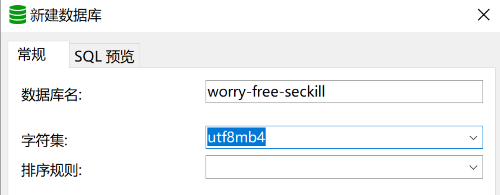
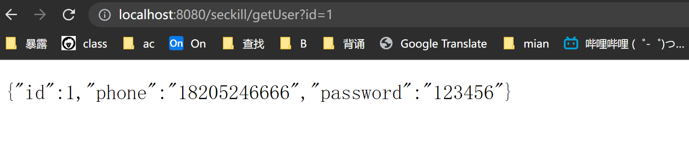

# 无忧秒杀(worry-free-seckill)
## 架构 —— 这部分等项目结束补充

这部分包括架构图，以及组件选择的理由

**无忧秒杀的部署架构图**

**无忧秒杀的分层架构图**

**无忧秒杀的业务架构图**

---

<div align='center'> ** 分割线 ** </div>

---

## 环境搭建

### 开发环境搭建

#### 1. 添加pom文件依赖

```xml

<dependencies>
    <!--        环境搭建阶段-->
    <!--        单元测试-->
    <dependency>
        <groupId>junit</groupId>
        <artifactId>junit</artifactId>
        <version>4.12</version>
        <scope>test</scope>
    </dependency>
    <!--        日志-->
    <dependency>
        <groupId>ch.qos.logback</groupId>
        <artifactId>logback-core</artifactId>
        <version>1.2.3</version>
    </dependency>
    <dependency>
        <groupId>ch.qos.logback</groupId>
        <artifactId>logback-classic</artifactId>
        <version>1.2.3</version>
    </dependency>
    <!--        数据库连接-->
    <dependency>
        <groupId>mysql</groupId>
        <artifactId>mysql-connector-java</artifactId>
        <version>5.1.47</version>
    </dependency>
    <!--        数据库连接池-->
    <dependency>
        <groupId>com.alibaba</groupId>
        <artifactId>druid</artifactId>
        <version>1.1.22</version>
    </dependency>
    <!--        mybatis-->
    <dependency>
        <groupId>org.mybatis</groupId>
        <artifactId>mybatis</artifactId>
        <version>3.5.4</version>
    </dependency>
    <dependency>
        <groupId>org.mybatis</groupId>
        <artifactId>mybatis-spring</artifactId>
        <version>1.3.2</version>
    </dependency>
    <!--        servlet相关-->
    <dependency>
        <groupId>taglibs</groupId>
        <artifactId>standard</artifactId>
        <version>1.1.2</version>
    </dependency>
    <dependency>
        <groupId>jstl</groupId>
        <artifactId>jstl</artifactId>
        <version>1.2</version>
    </dependency>
    <dependency>
        <groupId>javax.servlet</groupId>
        <artifactId>javax.servlet-api</artifactId>
        <version>3.1.0</version>
    </dependency>
    <!--        spring相关-->
    <dependency>
        <groupId>org.springframework</groupId>
        <artifactId>spring-core</artifactId>
        <version>5.2.6.RELEASE</version>
    </dependency>
    <dependency>
        <groupId>org.springframework</groupId>
        <artifactId>spring-core</artifactId>
        <version>5.2.6.RELEASE</version>
    </dependency>
    <!--        DAO层-->
    <dependency>
        <groupId>org.springframework</groupId>
        <artifactId>spring-jdbc</artifactId>
        <version>5.2.6.RELEASE</version>
    </dependency>
    <dependency>
        <groupId>org.springframework</groupId>
        <artifactId>spring-tx</artifactId>
        <version>5.2.6.RELEASE</version>
    </dependency>
    <!--        springmvc-->
    <dependency>
        <groupId>org.springframework</groupId>
        <artifactId>spring-web</artifactId>
        <version>5.2.6.RELEASE</version>
    </dependency>
    <dependency>
        <groupId>org.springframework</groupId>
        <artifactId>spring-webmvc</artifactId>
        <version>5.2.6.RELEASE</version>
    </dependency>
    <!--        spring test -->
    <dependency>
        <groupId>org.springframework</groupId>
        <artifactId>spring-test</artifactId>
        <version>5.2.6.RELEASE</version>
    </dependency>
    <!--        Java使用redis的依赖-->
    <dependency>
        <groupId>redis.clients</groupId>
        <artifactId>jedis</artifactId>
        <version>2.9.3</version>
    </dependency>
    <!--        spring和redis整合的依赖-->
    <dependency>
        <groupId>org.springframework.data</groupId>
        <artifactId>spring-data-redis</artifactId>
        <version>2.1.10.RELEASE</version>
    </dependency>
</dependencies>
```

#### 2. 配置文件

- spring相关的：dao、web
- logback日志
- mybatis

## 数据库

数据库名字：worry-free-seckill



- 创建表

  - 秒杀商品表
  - 秒杀订单表
  - 用户表

  ```sql
  -- 秒杀商品表
  CREATE TABLE `seckill_item` (
    `id` int(11) NOT NULL AUTO_INCREMENT,
    `name` varchar(255) DEFAULT NULL,
    `number` int(11) DEFAULT NULL,
    `start_time` datetime DEFAULT NULL ON UPDATE CURRENT_TIMESTAMP,
    `end_time` datetime DEFAULT NULL ON UPDATE CURRENT_TIMESTAMP,
    `create_time` datetime DEFAULT NULL ON UPDATE CURRENT_TIMESTAMP,
    `price` decimal(10,2) DEFAULT NULL,
    PRIMARY KEY (`id`)
  ) ENGINE=InnoDB DEFAULT CHARSET=utf8;
  
  -- 秒杀订单表
  CREATE TABLE `seckill_order` (
    `id` int(11) NOT NULL AUTO_INCREMENT,
    `seckill_item_id` int(11) DEFAULT NULL,
    `user_id` int(11) DEFAULT NULL,
    `state` tinyint(4) NOT NULL DEFAULT '-1',
    `create_time` datetime DEFAULT NULL ON UPDATE CURRENT_TIMESTAMP,
    PRIMARY KEY (`id`)
  ) ENGINE=InnoDB DEFAULT CHARSET=utf8;
  
  
  -- 用户表
  CREATE TABLE `user` (
    `id` int(11) NOT NULL AUTO_INCREMENT,
    `phone` varchar(255) DEFAULT NULL,
    `password` varchar(255) DEFAULT NULL,
    PRIMARY KEY (`id`)
  ) ENGINE=InnoDB DEFAULT CHARSET=utf8;
  ```

## 测试环境

**实体类User**

```java
package com.zhoudbw.seckill.entity;

/**
 * 用户表
 */
public class User {

    public User() {
    }

    public User(String phone, String password) {
        this.phone = phone;
        this.password = password;
    }

    private int id;
    private String phone;
    private String password;

    public int getId() {
        return id;
    }

    public void setId(int id) {
        this.id = id;
    }

    public String getPhone() {
        return phone;
    }

    public void setPhone(String phone) {
        this.phone = phone;
    }

    public String getPassword() {
        return password;
    }

    public void setPassword(String password) {
        this.password = password;
    }
}
```

**UserDao**

```java
package com.zhoudbw.seckill.dao;

import com.zhoudbw.seckill.entity.User;

public interface UserDao {


    /**
     * 根据id查找用户 (测试环境)
     * @param id
     * @return
     */
    User getUser(int id);

}
```

**UserMapper**

```java
<?xml version="1.0" encoding="UTF-8"?>
<!DOCTYPE mapper PUBLIC "-//mybatis.org//DTD Mapper 3.0//EN"
        "http://mybatis.org/dtd/mybatis-3-mapper.dtd">
<mapper namespace="com.zhoudbw.seckill.dao.UserDao">

    <select id="getUser" resultType="User" parameterType="int">
        select * from user where id = #{id}
    </select>

</mapper>
```

**UserService**

```java
package com.zhoudbw.seckill.service;

import com.zhoudbw.seckill.entity.User;

public interface UserService {

    User getUser(int id);
}
```

**UserServiceImpl**

```java
package com.zhoudbw.seckill.service.impl;

import com.zhoudbw.seckill.dao.UserDao;
import com.zhoudbw.seckill.entity.User;
import com.zhoudbw.seckill.service.UserService;
import org.springframework.beans.factory.annotation.Autowired;
import org.springframework.stereotype.Service;

@Service
public class UserServiceImpl implements UserService {

    @Autowired
    UserDao userDao;

    public User getUser(int id) {
        // 接口.调用方法，内容的执行逻辑
        return userDao.getUser(id);
    }
}
```

**UserController**

```java
package com.zhoudbw.seckill.controller;

import cn.hutool.core.util.StrUtil;
import com.zhoudbw.seckill.entity.User;
import com.zhoudbw.seckill.service.UserService;
import org.springframework.beans.factory.annotation.Autowired;
import org.springframework.stereotype.Controller;
import org.springframework.web.bind.annotation.RequestMapping;
import org.springframework.web.bind.annotation.ResponseBody;

@Controller
@RequestMapping("/seckill")
public class UserController {
    @Autowired
    UserService userService;
    @RequestMapping(value = "/getUser")
    @ResponseBody
    public User getUser(int id) {
        return userService.getUser(id);
    }
}
```

**web.xml**

```xml
<?xml version="1.0" encoding="UTF-8"?>
<web-app version="3.1" xmlns="http://xmlns.jcp.org/xml/ns/javaee"
         xmlns:xsi="http://www.w3.org/2001/XMLSchema-instance"
         xsi:schemaLocation="http://xmlns.jcp.org/xml/ns/javaee
         http://xmlns.jcp.org/xml/ns/javaee/web-app_3_1.xsd">


    <welcome-file-list>
        <welcome-file>index.jsp</welcome-file>
    </welcome-file-list>

    <!--    配置springmvc-->
    <servlet>
        <servlet-name>duyi-seckill-dispatcher</servlet-name>
        <servlet-class>org.springframework.web.servlet.DispatcherServlet</servlet-class>
        <!--    需要加载的配置文件-->
        <init-param>
            <param-name>contextConfigLocation</param-name>
            <param-value>classpath:spring/*.xml</param-value>
        </init-param>
    </servlet>

    <!--    配置mvc转发器拦截地址-->
    <!--    总之，关于web.xml的url映射的小知识:-->
    <!--    < url-pattern>/</url-pattern>  会匹配到/login这样的路径型url，不会匹配到模式为*.jsp这样的后缀型url-->
    <!--    < url-pattern>/*</url-pattern> 会匹配所有url：路径型的和后缀型的url(包括/login,*.jsp,*.js和*.html等)-->
    <servlet-mapping>
        <servlet-name>duyi-seckill-dispatcher</servlet-name>
        <url-pattern>/</url-pattern>
    </servlet-mapping>

</web-app>
```

**用户表添加数据进行测试**

INSERT INTO `worry-free-seckill`.`user`(`id`, `phone`, `password`) VALUES (1, '18205246666', '123456')

```error
Cannot create inner bean 'org.springframework.data.redis.serializer.GenericJackson2JsonRedisSerializer#70d50dda' of type [org.springframework.data.redis.serializer.GenericJackson2JsonRedisSerializer] while setting bean property 'valueSerializer';  缺少Json转Redis序列化的jar包
```

```resolve
<dependency>
    <groupId>com.fasterxml.jackson.core</groupId>
    <artifactId>jackson-databind</artifactId>
    <version>2.10.3</version>
</dependency>
```



---

<div align='center'> ** 分割线 ** </div>

---

